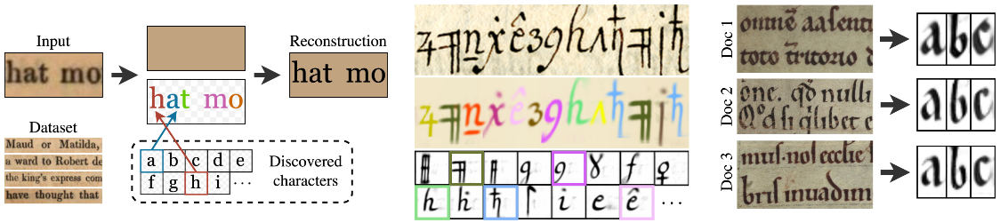

# The Learnable Typewriter <br><sub>A Generative Approach to Text Line Analysis</sub>
Official PyTorch implementation of [The Learnable Typewriter: A Generative Approach to Text Line Analysis](https://imagine.enpc.fr/~siglidii/learnable-typewriter/).  
Authors: [Yannis Siglidis](https://imagine.enpc.fr/~siglidii/), [Nicolas Gonthier](https://perso.telecom-paristech.fr/gonthier/), [Julien Gaubil](https://juliengaubil.github.io/), [Tom Monnier](https://www.tmonnier.com/), [Mathieu Aubry](http://imagine.enpc.fr/~aubrym/).  
Research Institute: [Imagine](https://imagine.enpc.fr/), _LIGM, Ecole des Ponts, Univ Gustave Eiffel, CNRS, Marne-la-Vallée, France_

## Install :seedling:
```shell
conda create --name ltw pytorch==1.9.1 torchvision==0.10.1 cudatoolkit=11.3 -c pytorch -c conda-forge
conda activate ltw
python -m pip install -r requirements.txt
```

### Datasets :sunny: Models :hammer:
Download & extract [datasets.zip](https://www.dropbox.com/s/0fa9hcbfu9vr3t2/datasets.zip?dl=0) and [runs.zip](https://www.dropbox.com/s/c4c7lbp1ydqs9dj/runs.zip?dl=0) in the parent folder.

## Inference :peach:
For minimal inference and plotting we provide a [standalone notebook. ](https://colab.research.google.com/drive/1XAMUPkpTzkKCd5ZH5jn8dy4_ukSX8slJ?usp=sharing)

To reproduce the figures of the paper run the `scripts/figures.ipynb` notebook.

Helper scripts are also provided to perform evaluation on the corresponding datasets:

```python
python scripts/eval.py -i <MODEL-PATH> {--eval, --eval_best}
```

and produce figures and sprites for certain samples:

```python
python scripts/eval.py -i <MODEL-PATH> -s {train, val, test} -id 0 0 0 -is 1 2 3 --plot_sprites
```

## Training :blossom:
Training and model configure is performed though hydra.
We supply the corresponding config files for all our baseline experiments.

### Google :newspaper:
```python
python scripts/train.py supervised-google.yaml
python scripts/train.py unsupervised-google.yaml
```

### Copiale :scroll:
```python 
python scripts/train.py supervised-copiale.yaml
python scripts/train.py unsupervised-copiale.yaml
```

### Fontenay :church:
```python
python scripts/train.py supervised-fontenay.yaml
```

and finetune with:

```python
python scripts/fontenay.py -i fontenay/fontenay/<MODEL_NAME> -o fontenay/fontenay-ft/ --max_epochs 150 -k "training.optimizer.lr=0.001"
```

> To all of the above experiment config files, additional command line overrides could be applied to further modify them using the [hydra syntax](https://hydra.cc/docs/advanced/override_grammar/basic/).

### Custom Dataset :floppy_disk:
Trying the LT on a new dataset is dead easy.

First create a config file:

```
configs/<DATASET_ID>.yaml

...

DATASET-TAG:
  path: <DATASET-NAME>/
  sep: ''                    # How the character separator is denoted in the annotation. 
  space: ' '                 # How the space is denoted in the annotation.
```

Then create the dataset folder:

```
datasets/<DATASET-NAME>
├── annotation.json
└── images
  ├── <image_id>.jpg
  └── ...
```

The annotation.json file should be a dictionary with entries of the form:
```
    "<image_id>": {
        "split": "train",                            # {"train", "val", "test"} - "val" is ignored in the unsupervised case.
        "label": "A beautiful calico cat."           # The text that corresponds to this line.
    },
```

You can completely ignore the annotation.json file in the case of unsupervised training without evaluation.


### Logging :chart_with_downwards_trend:
Logging is done through tensorboard. To visualize results run:

```bash
tensorboard --logdir ./<run_dir>/
```

_If you want to dive in deeper, check out our [experimental features](https://github.com/ysig/learnable-typewriter/blob/main/EXPERIMENTAL.md)._

### Citing :dizzy:

```bibtex
@misc{the-learnable-typewriter,
	title = {The Learnable Typewriter: A Generative Approach to Text Line Analysis},
	author = {Siglidis, Ioannis and Gonthier, Nicolas and Gaubil, Julien and Monnier, Tom and Aubry, Mathieu},
	publisher = {arXiv},
	year = {2023},
	url = {https://arxiv.org/abs/2302.01660},
	keywords = {Computer Vision and Pattern Recognition (cs.CV), FOS: Computer and information sciences, FOS: Computer and information sciences},
	doi = {10.48550/ARXIV.2302.01660},
	copyright = {Creative Commons Attribution 4.0 International}
}
```

## Also check out :rainbow:
If you like this project, have also a look to related work produced by our team:

- [Monnier et al. - Share With Thy Neighbors: Single-View Reconstruction by Cross-Instance Consistency (ECCV 2022)](https://www.tmonnier.com/UNICORN/)
- [Loiseau et al. - Representing Shape Collections with Alignment-Aware Linear Models (3DV 2021)](https://romainloiseau.github.io/deep-linear-shapes/)
- [Monnier et al. - Unsupervised Layered Image Decomposition into Object Prototypes (ICCV 2021)](https://arxiv.org/abs/2006.11132)
- [Monnier et al. - Deep Transformation Invariant Clustering (NeurIPS 2020)](https://arxiv.org/abs/2006.11132)
- [Deprelle et al. - Learning elementary structures for 3D shape generation and matching (NeurIPS 2019)](https://arxiv.org/abs/1908.04725)
- [Groueix et al. - 3D-CODED: 3D Correspondences by Deep Deformation (ECCV 2018)](https://arxiv.org/abs/1806.05228)
- [Groueix et al. - AtlasNet: A Papier-Mache Approach to Learning 3D Surface Generation (CVPR 2018)](https://arxiv.org/abs/1802.05384)


## Acknowledgements :sparkles:
We would like to thank Malamatenia Vlachou and Dominique Stutzmann for sharing ideas, insights and data for applying our method in paleography; Vickie Ye and Dmitriy Smirnov for useful insights and discussions; Romain Loiseau, Mathis Petrovich, Elliot Vincent, Sonat Baltacı for manuscript feedback and constructive insights. This work was partly supported by the European Research Council (ERC project DISCOVER, number 101076028), ANR project EnHerit ANR-17-CE23-0008, ANR project VHS ANR-21-CE38-0008 and HPC resources from GENCI-IDRIS (2022-AD011012780R1, AD011012905).